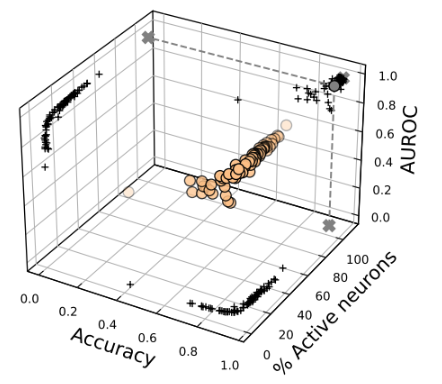
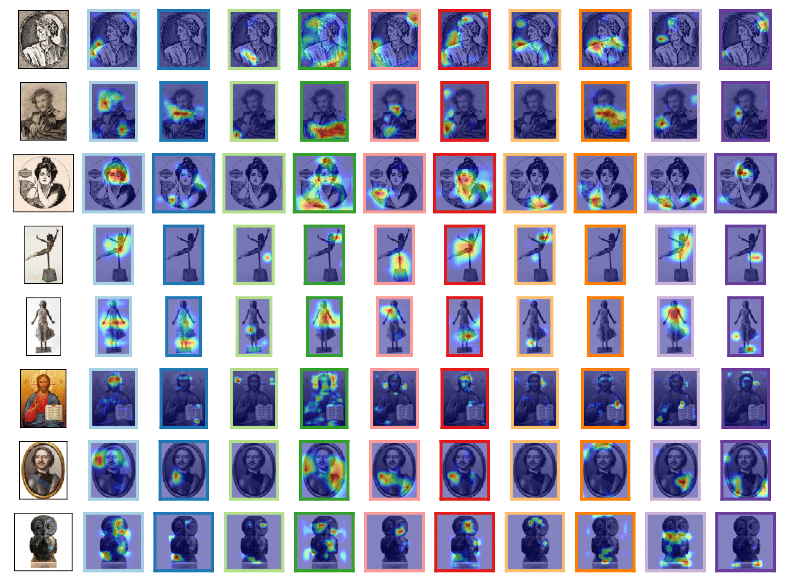
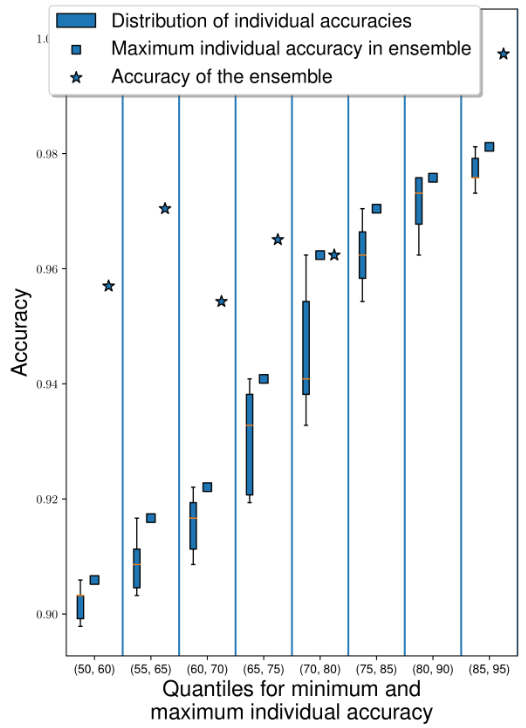

# S-MOEvoPruneDeepTL

This is the official repository of Multiobjective evolutionary pruning of Deep Neural Networks with Transfer Learning for improving their performance and robustness

## Code

The implementation of EvoPruneDeepTL is divided in the following folders:

   * MOEvoPruneDeepTL: the folder contains the python files for the approach.
   * ensemble: the folder contains the python files to run the ensemble.
   * heatmaps: the folder contains the python files to run the heatmaps.
   * configs: contains the configuration files for each analyzed dataset in the paper.
   * images: it contains the images of some experiments of the paper for some of the datasets.
  
 ### Execution
 
 To execute the code presented above, it is only required:
    
    Python >= 3.6, Keras >= 2.2.4
    
  Then, given the previous folders and a dataset, the command is the following:
  
    python3 main.py configs/configDataset[dataset].csv configs/configGAFS.csv numberExecution
    
   where:
   
   * dataset corresponds the dataset to analyze.
   * the GA configuration for the model
   * numberExecution referes to the number of execution that we are carrying out.
    
 
## Datasets

The used datasets in this paper can be downloaded from:

  * SRSMAS: https://sci2s.ugr.es/CNN-coral-image-classification
  * RPS: https://www.tensorflow.org/datasets/catalog/rock_paper_scissors
  * LEAVES: https://www.tensorflow.org/datasets/catalog/citrus_leaves
  * PAINTING: https://www.kaggle.com/thedownhill/art-images-drawings-painting-sculpture-engraving
  * PLANTS: https://github.com/pratikkayal/PlantDoc-Dataset
  * CATARACT: https://www.kaggle.com/jr2ngb/cataractdataset

## Results

MOEvoPruneDeepTL is able to optimize to optimize the accuracy, complexity and robustness of sparse layers using a multi-objective genetic algorithm. We show some of the plots taken from our experiments:

<ins> Pareto Fronts </ins>

The Pareto front is composed of the best solutions of the 10 runs of MOEvoPruneDeepTL. The three axis show the accuracy, complexity and robustness.

<ins> Explaining most important neurons using heatmaps </ins>

We have taken the 10 most important neurons (those that appear in most solutions of the Pareto front) and we have used GradCam to explore the parts of the images that the model selects as the most relevant in order to classify the instances:

<ins> Ensemble modelling </ins>

For each quantile of mininum and maximum accuracy, we have performed the ensembe of all the models that are in that range to check if the ensemble performs better than the best of such interval:

